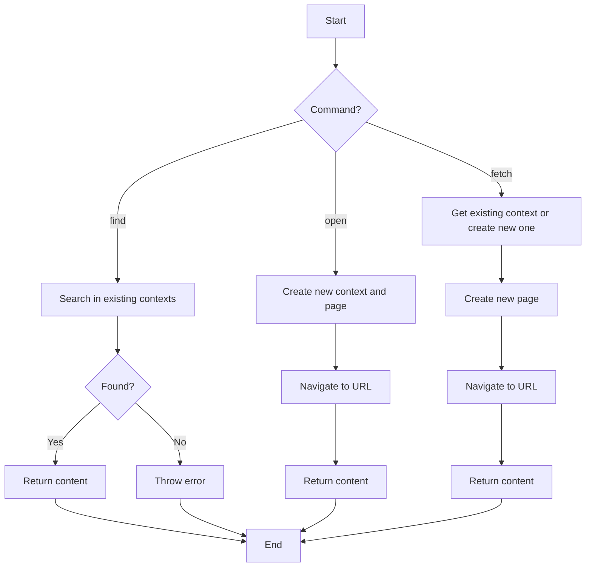

# Playwright Tool Extension Plan

## Overview

This document outlines the plan for extending the existing `playwrightTool` in the qterm project to add three new commands:

1. `find` - Search for a page with the given URL in existing browser contexts and return its content if found, otherwise return an error.
2. `open` - Always create a new context and page, navigate to the URL, and return the content.
3. `fetch` - Use an existing context but always create a new page, navigate to the URL, and return the content.

Additionally, we need to update the documentation in `docs/playwright-tool-implementation.md` to reflect these changes.

## Current Implementation Analysis

The current `playwrightTool` implementation in `src/tools.ts`:
- Takes a URL and a connect parameter
- Connects to an existing Chrome instance or launches a new browser
- Searches for a page with the given URL in existing contexts
- If not found, opens a new context and page with the URL
- Returns the page content
- Closes the browser when done

However, there's a discrepancy between the implementation and the imports in `terminal.ts` and `cli.ts`, which import `webPageHtmlTool` instead of `playwrightTool`.

## Implementation Plan

### 1. Modify the `playwrightTool` Schema

Update the schema to accept a `command` parameter with the following possible values:
- `find` (default) - Search for a page with the given URL in existing contexts
- `open` - Create a new context and page
- `fetch` - Use an existing context but create a new page

```typescript
schema: z.object({
  url: z.string().describe('The URL of the web page to fetch.'),
  connect: z.boolean().describe('Whether to connect to an open browser using CDP. Defaults to true.'),
  command: z.enum(['find', 'open', 'fetch']).default('find').describe('The command to execute: find (search in existing contexts), open (create new context), or fetch (use existing context, create new page).'),
}),
```

### 2. Implement the Command Logic

Modify the `playwrightTool` implementation to handle the different commands:

```typescript
async ({ url, connect = true, command = 'find' }): Promise<string> => {
  console.log('connect', connect, 'command', command);
  const { chromium } = await import('playwright');
  let browser: Browser | undefined;
  try {
    browser ??= connect 
      ? await chromium.connectOverCDP('http://localhost:9222') 
      : await chromium.launch();
    
    // Command: find - Search in existing contexts
    if (command === 'find') {
      for (const context of await browser.contexts()) {
        for (const page of await context.pages()) {
          if (page.url().startsWith(url)) {
            await page.reload({ waitUntil: 'load'});
            return await page.content();
          }
        }
      }
      throw new Error(`No page found with URL starting with: ${url}`);
    }
    
    // Command: open - Always create a new context and page
    if (command === 'open') {
      const context = await browser.newContext();
      const page = await context.newPage();
      await page.goto(url);
      return await page.content();
    }
    
    // Command: fetch - Use existing context but create a new page
    if (command === 'fetch') {
      let context;
      if ((await browser.contexts()).length > 0) {
        context = (await browser.contexts())[0];
      } else {
        context = await browser.newContext();
      }
      const page = await context.newPage();
      await page.goto(url);
      return await page.content();
    }
    
    throw new Error(`Unknown command: ${command}`);
  } finally {
    await browser?.close();
  }
}
```

### 3. Update the Tool Name and Exports

Since `terminal.ts` and `cli.ts` are importing `webPageHtmlTool`, we have two options:

1. Rename `playwrightTool` to `webPageHtmlTool` to match the imports
2. Keep `playwrightTool` and add an alias export for `webPageHtmlTool`

Option 2 seems more flexible, so we'll implement that:

```typescript
export const webPageHtmlTool = playwrightTool;
```

### 4. Update the Documentation

Update `docs/playwright-tool-implementation.md` to:
- Reflect the new command parameter and its possible values
- Explain the behavior of each command
- Provide examples of how to use each command
- Update any references to `webPageHtmlTool` to match our implementation

## Testing Plan

After implementing these changes, we should test each command:

1. `find` command:
   - Start Chrome with remote debugging enabled
   - Navigate to a URL
   - Use the tool with the `find` command and the same URL
   - Verify it returns the content of the existing page

2. `open` command:
   - Use the tool with the `open` command and a URL
   - Verify it creates a new context and page
   - Verify it returns the content of the new page

3. `fetch` command:
   - Start Chrome with remote debugging enabled
   - Use the tool with the `fetch` command and a URL
   - Verify it uses an existing context but creates a new page
   - Verify it returns the content of the new page

## Flow Diagram



## Implementation Risks and Considerations

1. **Browser Management**: The current implementation closes the browser after each operation. This might not be ideal for performance if the tool is used frequently. Consider keeping the browser instance alive between calls.

2. **Error Handling**: We need to ensure proper error handling, especially for the `find` command which might not find a matching page.

3. **Compatibility**: Ensure the changes are compatible with the rest of the codebase, especially considering the discrepancy between the implementation and imports.

4. **Documentation Accuracy**: Make sure the documentation accurately reflects the implementation, including the relationship between `playwrightTool` and `webPageHtmlTool`.