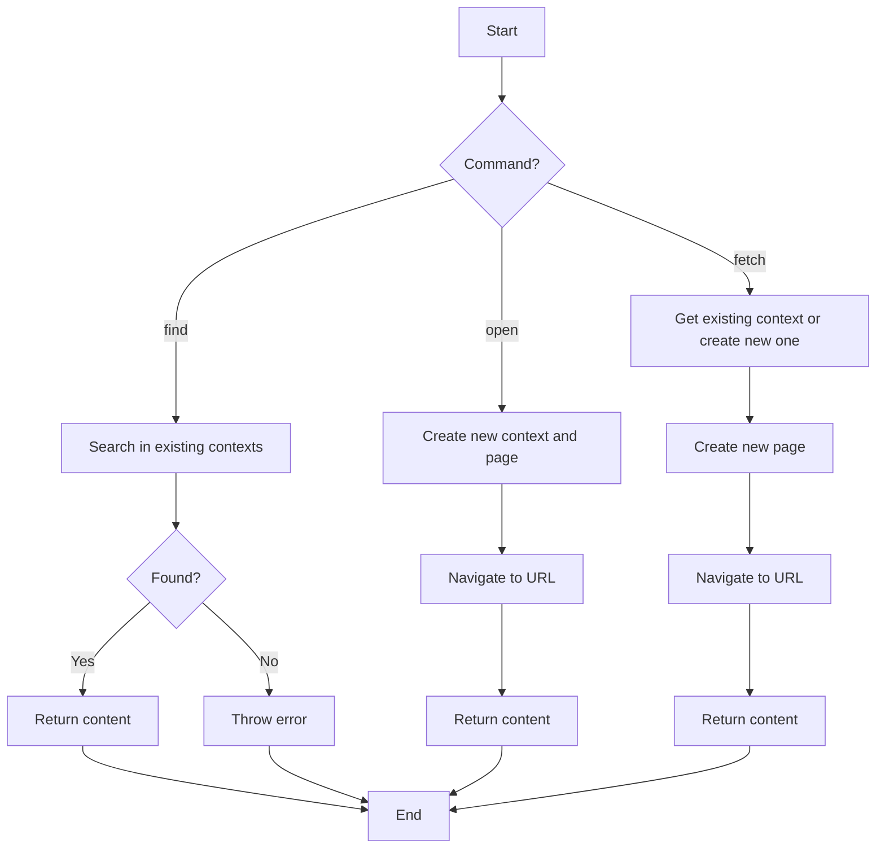

# Playwright Tool Implementation

## Overview

This document outlines the implementation of the Playwright-based tool for interacting with web pages in the qterm project. The tool provides three different commands for retrieving HTML content from web pages.

## Prerequisites

Before using this tool, you'll need to install the Playwright dependency:

```bash
npm install playwright
```

## Implementation Details

### Tool Definition

The `playwrightTool` is defined in `src/tools.ts` with the following parameters:

- `url`: The URL of the web page to interact with (required)
- `connect`: Whether to connect to an open browser using CDP (optional, defaults to true)
- `command`: The command to execute (optional, defaults to 'find')
  - `find`: Search for a page with the given URL in existing contexts
  - `open`: Always create a new context and page
  - `fetch`: Use an existing context but always create a new page

### Commands

The tool supports three commands:

1. **find** (default): Searches for a page with the given URL in existing browser contexts.
   - If found, reloads the page and returns its content
   - If not found, throws an error

2. **open**: Always creates a new context and page.
   - Creates a new browser context
   - Creates a new page in that context
   - Navigates to the specified URL
   - Returns the page content

3. **fetch**: Uses an existing context but always creates a new page.
   - Uses the first available context or creates a new one if none exist
   - Creates a new page in that context
   - Navigates to the specified URL
   - Returns the page content


## How It Works

The `playwrightTool` works as follows:

1. It takes three parameters:
   - `url`: The URL of the web page to interact with (required)
   - `connect`: Whether to connect to an open browser using CDP (optional, defaults to true)
   - `command`: The command to execute (optional, defaults to 'find')

2. When invoked, it:
   - Dynamically imports Playwright to avoid loading it unless the tool is used
   - Either connects to an existing browser using CDP or launches a new one
   - Executes the specified command (find, open, or fetch)
   - Returns the HTML content of the page
   - Closes the browser when done

3. Error handling:
   - If an error occurs, it ensures the browser is properly closed
   - Throws the error for proper handling by the calling code

## Testing

To test the tool:

1. Using the 'find' command (default):
   ```
   >> playwright({ url: "https://example.com" })
   ```

2. Using the 'open' command:
   ```
   >> playwright({ url: "https://example.com", command: "open" })
   ```

3. Using the 'fetch' command:
   ```
   >> playwright({ url: "https://example.com", command: "fetch" })
   ```

4. With an existing browser (requires starting Chrome with remote debugging enabled):
   ```
   >> playwright({ url: "https://example.com", connect: true, command: "fetch" })
   ```

   To start Chrome with remote debugging enabled:
   ```bash
   # On macOS
   /Applications/Google\ Chrome.app/Contents/MacOS/Google\ Chrome --remote-debugging-port=9222
   
   # On Windows
   start chrome --remote-debugging-port=9222
   
   # On Linux
   google-chrome --remote-debugging-port=9222
   ```

## Flow Diagram



## Notes

- The tool dynamically imports Playwright to avoid loading it unless the tool is used, which improves startup performance.
- When connecting to an existing browser, it uses the default CDP URL of 'http://localhost:9222'. If you need to connect to a different URL, you'll need to modify the code.
- The tool includes proper error handling to ensure that browsers are closed when they should be, preventing resource leaks.
- The 'find' command will throw an error if no matching page is found, while the 'open' and 'fetch' commands will always create a new page.