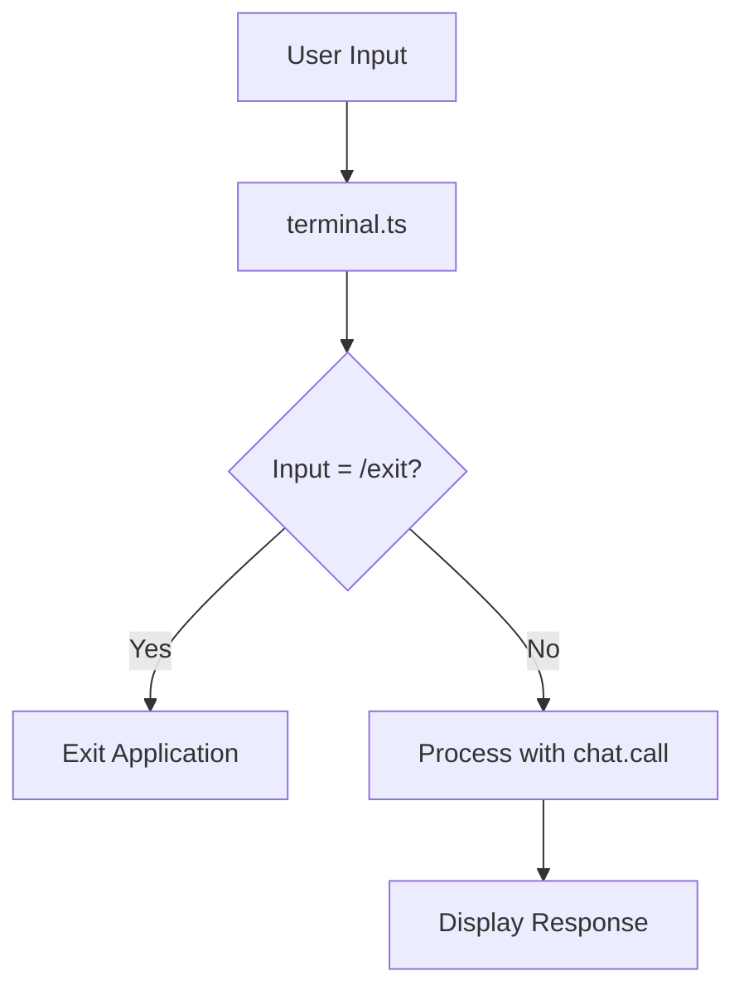
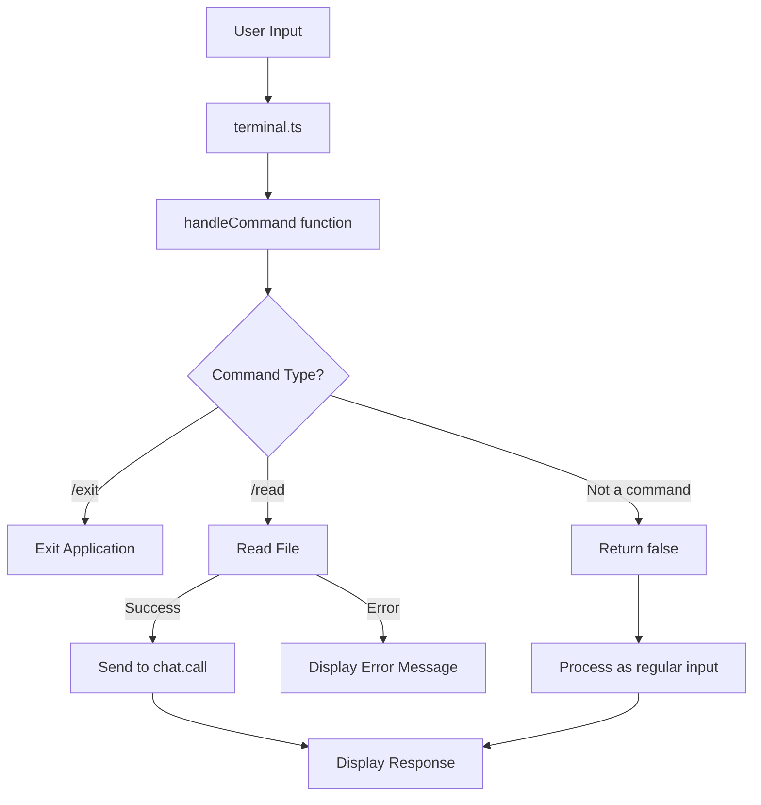

# Implementation Plan for "/read" Terminal Command

Based on the code analysis and requirements, here's a detailed plan for implementing the "/read" terminal command that reads a file and sends its contents to the chat.call function.

## Current System Overview



## Proposed Implementation



## Code Changes

The main changes will be in the `terminal.ts` file:

1. Create a new `handleCommand` function that processes commands
2. Move the existing "/exit" command logic to this function
3. Add the new "/read" command logic to this function
4. Update the `startPrompt` function to use the new `handleCommand` function
5. Return a boolean from `handleCommand` to indicate if the input was handled as a command

## Specific Code Implementation

The implementation will create a modular command handling system that makes it easy to add more commands in the future.

## Error Handling

The implementation will handle these error cases:
- File not found
- Permission issues
- Invalid file path
- Empty file path

## Testing Plan

After implementation, we should test the command with:
1. Valid file paths
2. Non-existent files
3. Files with different content types
4. Empty files
5. Files with special characters in the path

## Implementation Code

Here's the proposed code change for the `terminal.ts` file:

```typescript
// Add fs import at the top of the file
import * as fs from 'fs/promises';
import * as path from 'path';

/**
 * Handles terminal commands that start with "/"
 * 
 * @param input - The user input
 * @param rl - The readline interface
 * @param chat - The ChatAgent instance
 * @returns true if the input was handled as a command, false otherwise
 */
const handleCommand = async (
  input: string,
  rl: readline.Interface,
  chat: ChatAgent
): Promise<boolean> => {
  // Convert to lowercase for case-insensitive command matching
  const lowerInput = input.toLowerCase();
  
  // Handle /exit command
  if (lowerInput === '/exit') {
    console.log('Exiting chat...');
    rl.close();
    return true;
  }
  
  // Handle /read command
  if (lowerInput.startsWith('/read ')) {
    // Extract the file path from the input
    const filePath = input.slice('/read '.length).trim();
    
    if (!filePath) {
      console.log('Error: No file path provided. Usage: /read <file_path>');
      return true;
    }
    
    try {
      // Read the file
      const fileContent = await fs.readFile(filePath, 'utf8');
      
      // Send the file content to chat.call
      const response = await chat.call(fileContent.trim());
      console.log(`\n${response}\n`);
    } catch (error) {
      console.error('Error reading file:', error instanceof Error ? error.message : String(error));
    }
    
    return true;
  }
  
  // If we reach here, the input wasn't a recognized command
  return false;
};

// In the startPrompt function, modify the input handling:
const startPrompt = async (): Promise<void> => {
  while (true) {
    const input = await new Promise<string>((resolve) => {
      rl.question('>> ', resolve);
    });

    // Skip empty input
    if (input.trim() === '') {
      continue;
    }
    
    // Handle commands
    const commandHandled = await handleCommand(input, rl, chat);
    if (commandHandled) {
      continue;
    }
    
    // Process regular input
    try {
      const response = await chat.call(input.trim());
      console.log(`\n${response}\n`);
    } catch (error: unknown) {
      console.error('Error:', error instanceof Error ? error.message : String(error));
    }
  }
};
```

This implementation creates a separate `handleCommand` function that processes all commands starting with "/". This makes it easy to add more commands in the future by simply adding more conditions to the `handleCommand` function.